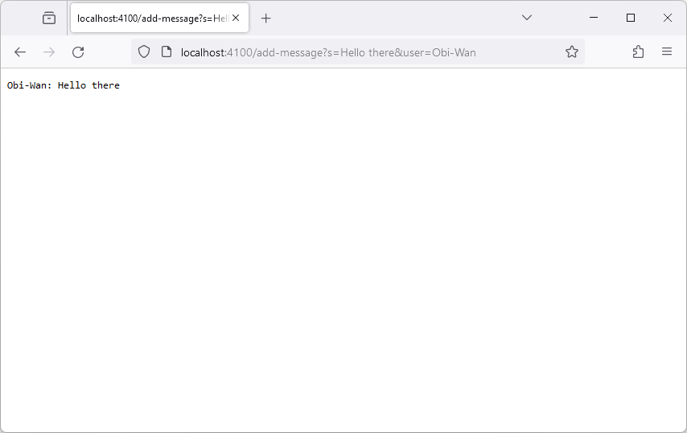
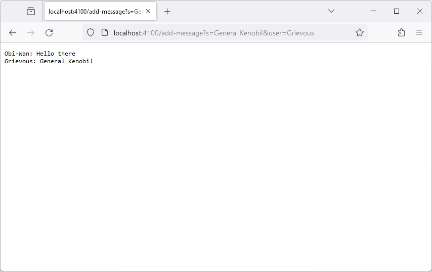
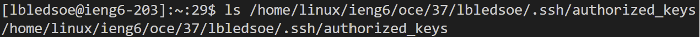
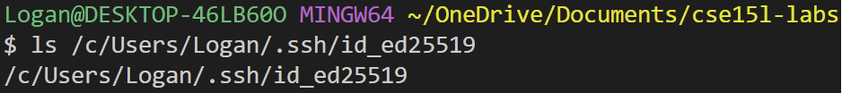
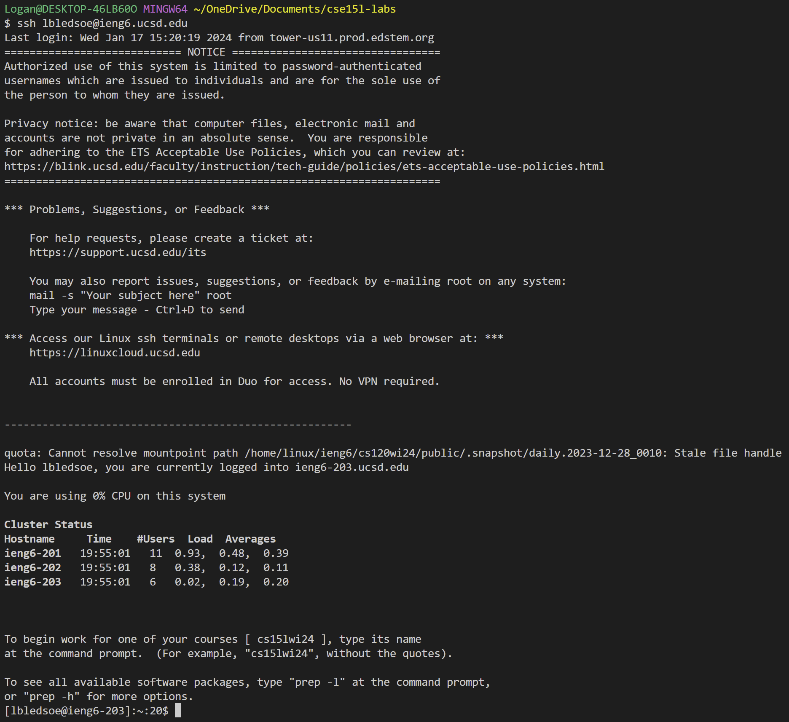

# Lab 2

## Part 1
**Code**
My implementation of ChatServer is a modification of the given [wavelet server](https://github.com/ucsd-cse15l-f23/wavelet), and it consists of the two files below:

**`ChatServer.java`**
```java
import java.io.IOException;
import java.net.URI;
import java.util.ArrayList;
import java.util.List;

class Handler implements URLHandler {
    List<String> messages = new ArrayList<>();
    private static final String ERROR_MESSAGE = "404 Not Found!";

    public String handleRequest(URI url) {
        //check for /add-message path
        if (!url.getPath().equals("/add-message")) {
            return ERROR_MESSAGE;
        }

        String parameters = url.getQuery();
        int index = parameters.indexOf("&user=");

        //check that both parameters exist
        if (!parameters.startsWith("s=") || index == -1) {
            return ERROR_MESSAGE;
        }

        //extract parameters
        String message = parameters.substring(2, index);
        String user = parameters.substring(index + 6);

        //format <user>: <message>
        String formattedMessage = user + ": " + message;

        //add to messages
        messages.add(formattedMessage);

        return getDisplay();
    }

    //returns string that is a concatenation all
    //strings in messages with newlines inbetween
    private String getDisplay() {
        String result = "";
        for (String str : messages) {
            result += str + "\n";
        }
        return result;
    }
}

class ChatServer {
    private static final String PORT_ERROR_MESSAGE =
            "Missing port number! Try any number between 1024 to 49151";

    public static void main(String[] args) throws IOException {
        if(args.length == 0){
            System.out.println(PORT_ERROR_MESSAGE);
            return;
        }

        int port = Integer.parseInt(args[0]);

        Server.start(port, new Handler());
    }
}
```
**`Server.java`**
```java
import java.io.IOException;
import java.io.OutputStream;
import java.net.InetSocketAddress;
import java.net.URI;

import com.sun.net.httpserver.HttpExchange;
import com.sun.net.httpserver.HttpHandler;
import com.sun.net.httpserver.HttpServer;

interface URLHandler {
    String handleRequest(URI url);
}

class ServerHttpHandler implements HttpHandler {
    URLHandler handler;
    ServerHttpHandler(URLHandler handler) {
      this.handler = handler;
    }
    public void handle(final HttpExchange exchange) throws IOException {
        // form return body after being handled by program
        try {
            String ret = handler.handleRequest(exchange.getRequestURI());
            // form the return string and write it on the browser
            exchange.sendResponseHeaders(200, ret.getBytes().length);
            OutputStream os = exchange.getResponseBody();
            os.write(ret.getBytes());
            os.close();
        } catch(Exception e) {
            String response = e.toString();
            exchange.sendResponseHeaders(500, response.getBytes().length);
            OutputStream os = exchange.getResponseBody();
            os.write(response.getBytes());
            os.close();
        }
    }
}

public class Server {
    public static void start(int port, URLHandler handler) throws IOException {
        HttpServer server = HttpServer.create(new InetSocketAddress(port), 0);

        //create request entrypoint
        server.createContext("/", new ServerHttpHandler(handler));

        //start the server
        server.start();
        System.out.println("Server Started!");
    }
}
```
**Screenshots**


In this screenshot, submitting the url in the browser caused `handleRequest(URI url)` to be called on the instance of `Handler` created in `main` with the `URL` argument containing `localhost:4100/add-message?s=Hello there&user=Kenobi`.
Finally, `handleRequest` calls the helper method `getDisplay()`.
Before all this, the `List` field, `messages`, was an empty `ArrayList`. After, it contains one string, `Kenobi: Hello there`.



Similar to the last screenshot, submitting the url in the browser caused `handleRequest(URI url)` to be called on the instance of `Handler` created in `main`.
However, this time the `URL` argument that is passed in contains `localhost:4100/add-message?s=General Kenobi&user=Grievous`.
Like before, `handleRequest` calls the helper method `getDisplay()`.
This took place right after the the previous screenshot was taken, so before this the `List` field, `messages`, contained just one string, `Kenobi: Hello there`.
After, it contains two strings, `Kenobi: Hello there` and `Grievous: General Kenobi!`, in that order.

## Part 2
**Absolute Path to the Private Key**


**Absolute Path to the Public Key**


**Terminal Interaction Login**


## Part 3
These past weeks, I learned how I could create a simple server using Java and mostly things I already know. I also learned more about ports (i.e. that there are default ones, reserved ones, and such), how to ssh into servers, and how to create ssh keys.
