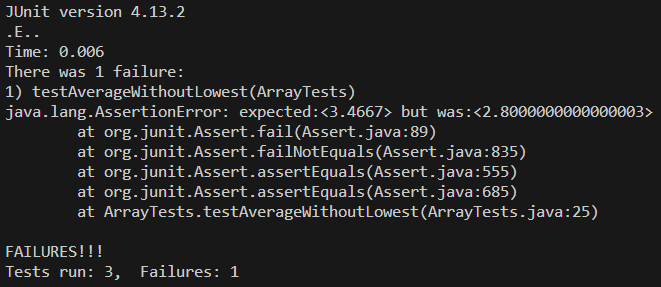

# Lab Report 3

## Part 1 - Bugs

**Method:** `averageWithoutLowest(double[] arr)`

**Inputs**

The failure producing and non-failure producing inputs are included in the `testAverageWithoutLowest()` test below.
```java
@Test
    public void testAverageWithoutLowest() {
        double[] sucessInput = { 4.0, 3.5, 1.1, 2.2, 4.0 };
        double[] failureInput = { 3.4, 2.0, 5.0, 2.0 };

        assertEquals(3.4250,
                ArrayExamples.averageWithoutLowest(sucessInput), 0.001);
        assertEquals(3.4667,
                ArrayExamples.averageWithoutLowest(failureInput), 0.001);
    }
```

**Symptom**



| **Type**                 | **Input**                   | **Expected** | **Actual** |
|----------------------|-------------------------|----------|--------|
| Non-Failure Inducing | 4.0, 3.5, 1.1, 2.2, 4.0 | 3.4250   | 3.4250 |
| Failure Inducing     | 3.4, 2.0, 5.0, 2.0      | 3.4667   | 2.8000 |

**Bug**

Before:
```java
static double averageWithoutLowest(double[] arr) {
        if (arr.length < 2) {
            return 0.0;
        }
        double lowest = arr[0];
        for (double num : arr) {
            if (num < lowest) {
                lowest = num;
            }
        }
        double sum = 0;
        for (double num : arr) {
            if (num != lowest) {
                sum += num;
            }
        }
        return sum / (arr.length - 1);
    }
```

After:
```java
static double averageWithoutLowest(double[] arr) {
        if (arr.length < 2) {
            return 0.0;
        }
        double lowest = arr[0];
        for (double num : arr) {
            if (num < lowest) {
                lowest = num;
            }
        }
        double sum = 0;
        for (double num : arr) {
            sum += num;
        }
        sum -= lowest;
        return sum / (arr.length - 1);
    }
```

The issue with the method was that, when summing over the array, it would not inclue any numbers that were equal to the lowest, rather than just the lowest.
The updated method above instead sums the *entire* array then subracts the lowest from that sum.

## Part 2 - Researching Commands
