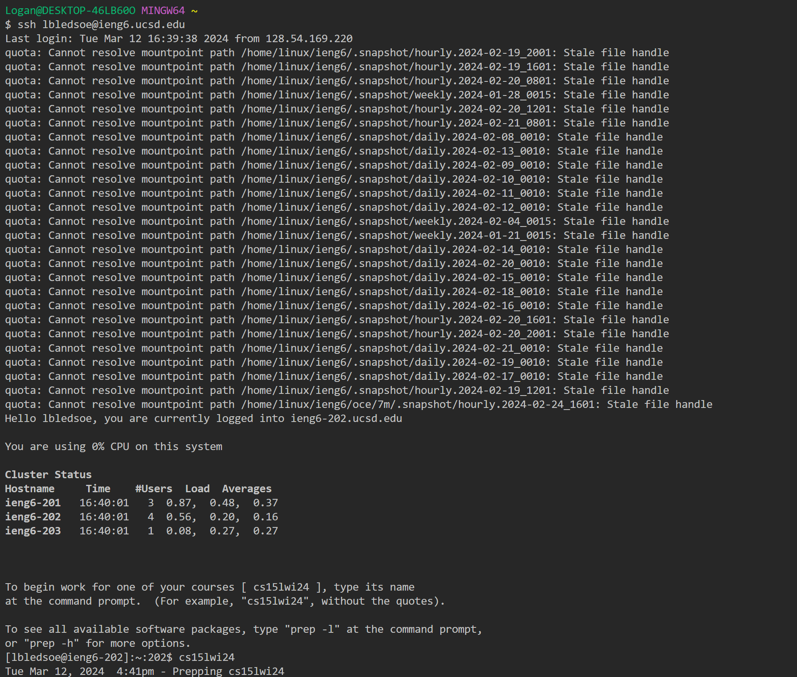
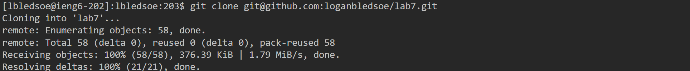
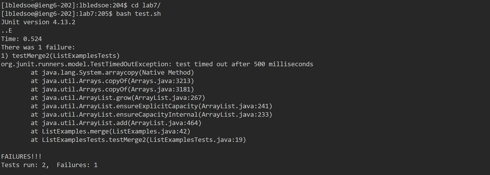
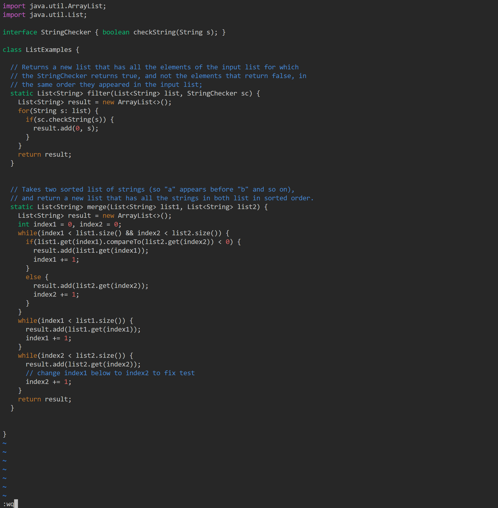
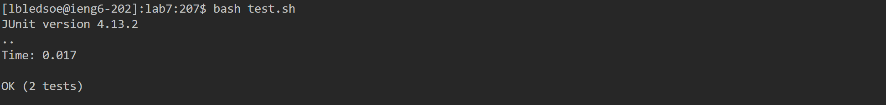
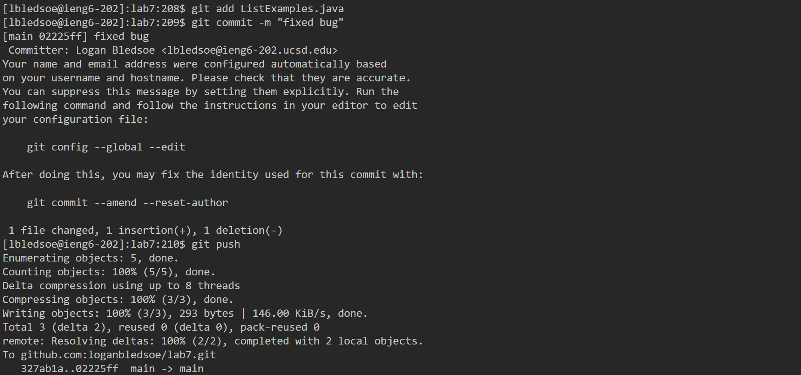

# Lab Report 4 - Week 7

## Step 4


**Keys Pressed:**
```
ssh<space>lbledsoe@ieng6.ucsd.edu<enter>
cs15lwi24<enter>
```

**Command(s) Ran:**
- `ssh lbledsoe@ieng6.ucsd.edu`
- `cs15lwi24`

## Step 5


**Keys Pressed:**
`git<space>clone<space><ctrl + v><enter>`

**Command(s) Ran:**
- `git clone git@github.com:loganbledsoe/lab7.git`

**Notes:**<br>
The url for the Github repository was on my clipboard, so I used ctrl + v (paste) to access it.

## Step 6


**Keys Pressed:**
```
cd<space>l<tab><enter>
bash<space>t<tab><enter>
```

**Command(s) Ran:**
- `cd lab7/`
- `bash test.sh`

**Notes:**<br>
Within the home directory there was only one file/directory that began with an `l`, `lab7/` and within the `lab7/` directory there was only one file that began with a `t`, `test.sh`. So, instead of typing these two paths/files out, I used tab autocomplete, only tying their first letters then hitting tab, to get each path/file for the commands.

## Step 7



**Keys Pressed:**
```
vim<space>L<tab>.<tab><enter>
43jexi2<esc>:wq<enter>
```

**Command(s) Ran:**
- `vim ListExamples.java`

**Notes:**<br>
Similar to the last step, I used tab autocomplete to type the file name `ListExamples.java` in the command `vim ListExamples.java`. Though in this case, there were four files that began with an `L` in the working directory: `ListExamples.java`, `ListExamples.class`, `ListExamplesTests.java`, `ListExamplesTests.java`. The files ending in `.class` do not tab autocomplete as an argument to the `vim` command, so that narrows it down to two files. So, after typing `L` and pressing tab, I typed `.` to give autocomplete the information it needed and pressed tab again.

The following is an explanation for my vim keystrokes:
- `43j`: Down motion with a count of 43. This brings me to line 43 where the bug is.
- 'e': This motion brings me to the end of the next word `index2` with my cursor on `1`.
- `x`: This deletes the character my cursor is on, `1`.
- `i`: This enters into insert mode.
- `2`: This inserts `2` following `index`.
- `<esc>`: This returns vim to normal mode.
- `:wq`: This saves the file and exits vim.


## Step 8


**Keys Pressed:**
```
<up><up><enter>
```

**Command(s) Ran:**
- `bash test.sh`

**Notes:**<br>
The `bash test.sh` command was two up in my command history due to step 6, so I used the up arrow twice to access it.


## Step 9


**Keys Pressed:**
```
git<space>add<space>L<tab>.<tab><enter>
git<space>commit<space>-m<space>"fixed<space>bugs"<enter>
git<space>push<enter>
```

**Command(s) Ran:**
- `git add ListExamples.java`
- `git commit -m "fixed bugs"`
- `git push`

**Notes:**<br>
Similar to step 7, I used tab autocomplete to type the file name `ListExamples.java` in the `git add ListExamples.java` command.
However, in this case the `git add` command allowed all four of the files starting with `L` to be autocompleted.
So, after typing `L` and hitting tab, I typed `.j` and hit tab again to clarify which file I wanted.