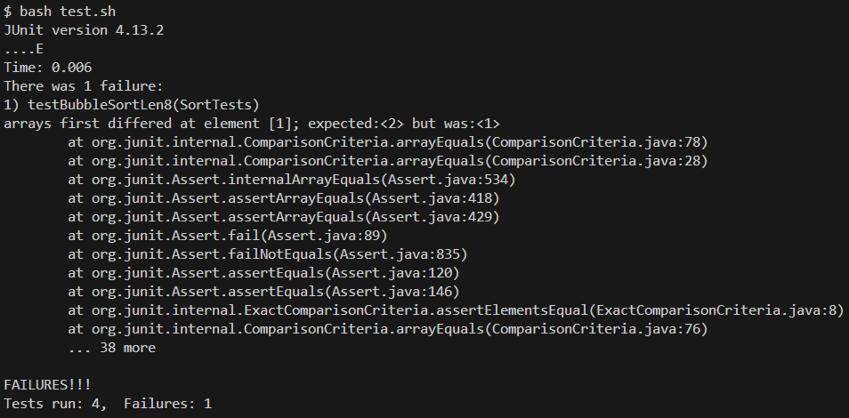
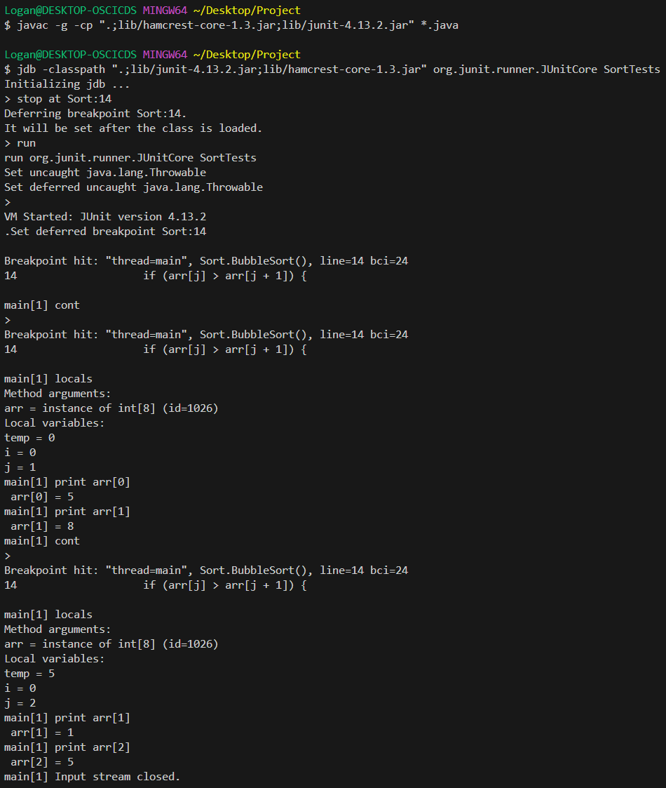

# Lab Report 5 - Week 9
## Part 1 - Debugging Scenario

### Original Post
Hi! I've written a method to sort an array of integers using the bubble sort algorithm.
It passes all my tests except one, and I cannot figure out why. The input is `{ 5, 8, 1, 2, 3, 4, 5, 6 }`, so I expect the array to be sorted into `{ 1, 2, 3, 4, 5, 5, 6, 8 }`.
But instead it becomes `{ 1, 1, 2, 3, 4, 5, 5, 6 }`. Every element is in the correct order, but some are missing, and some are duplicated.
I've looked though my code a bunch of times and I can't seem to find anything that would cause this.



### TA Response
Run your test that failed again, but pay close attention to what is being swapped and how local variables are changing.
It might help to use jdb and set breakpoints after each swap occurs.

### What the Sutdent Got From the Response
The student then commented out all tests except the one that failed and ran jdb with a breakpoint before line 14 of Sort.



After the first comparison, no swap occurs since `5 < 8`, and, as expected, no local variables (except the loop indices) are changed.
After the second comparsion, a swap does occur since `8 > 1`. `arr[1]` becomes `1` as expected, but `arr[2]` becomes `5` when it should have become `8`.
Also, `temp` is set to `5`. This explains the erroneous value of `arr[2]`.
Taking a closer look at line 15 -- the only location temp is set after it's initialized -- shows `temp` is not being set to the left value to swap as it should be.
`temp` is set to the ith element of `arr` during every swap when it should be set to the jth element.
This is the bug, and fixing it allows all the tests to pass.

### Setup Information

**File & Directory Structure**
```
|- Project/
    |- lib/
        |- hamcrest-core-1.3.jar
        |- junit-4.13.2.jar
    |- Sort.java
    |- SortTests.java
    |- test.sh
```

**Sort.java**
```java
class Sort {
    static void BubbleSort(int[] arr) {
        int temp = 0;
        for (int i = 0; i < arr.length - 1; i++) {
            for (int j = 0; j < arr.length - i - 1; j++) {
                if (arr[j] > arr[j + 1]) {
                temp = arr[i];
                arr[j] = arr[j + 1];
                arr[j + 1] = temp;
                }
            }
        }
    }
}
```

**SortTests.java**
```java
import org.junit.Test;

import static org.junit.Assert.*;

public class SortTests {
    @Test
    public void testBubbleSortSortedAlready() {
        int[] input = { 1, 2, 3, 4, 5 };
        int[] expected = { 1, 2, 3, 4, 5 };
        Sort.BubbleSort(input);
        assertArrayEquals(expected, input);
    }

    @Test
    public void testBubbleSortLen1() {
        int[] input = { 10 };
        int[] expected = { 10 };
        Sort.BubbleSort(input);
        assertArrayEquals(expected, input);
    }

    @Test
    public void testBubbleSortLen3() {
        int[] input = { 2, 1, 3 };
        int[] expected = { 1, 2, 3 };
        Sort.BubbleSort(input);
        assertArrayEquals(expected, input);
    }

    @Test
    public void testBubbleSortLen8() {
        int[] input = { 5, 8, 1, 2, 3, 4, 5, 6 };
        int[] expected = { 1, 2, 3, 4, 5, 5, 6, 8 };
        Sort.BubbleSort(input);
        assertArrayEquals(expected, input);
    }
}
```

**test.sh**
```sh
javac -cp .:lib/hamcrest-core-1.3.jar:lib/junit-4.13.2.jar *.java
java -cp .:lib/hamcrest-core-1.3.jar:lib/junit-4.13.2.jar org.junit.runner.JUnitCore sortTests
```

**Command Run to Trigger Bug:**
```
bash test.sh
```

## Part 2 - Reflection
One thing I learned -- and probably my biggest *single* takeaway -- from the second half of lab is how to use jdb.
Before this I knew debuggers existed but never gave them a try.
I would just place print statements everywhere to reach a similar effect.
This has worked but has started to get tedious and a little confusing, so I'm happy lab pushed me to look into the alternative.
And of course the use of it in lab has got me a little familiar with it -- at least the basics.
A more general thing I want to add is that the repeated practice with the command line thoughout all the labs have really got me to remember and undstanding things.
I'm now able to use the commands in other classes to speed things, and I feel like I now have a better understanding of how everything fits together (outputs, inputs, and such).
